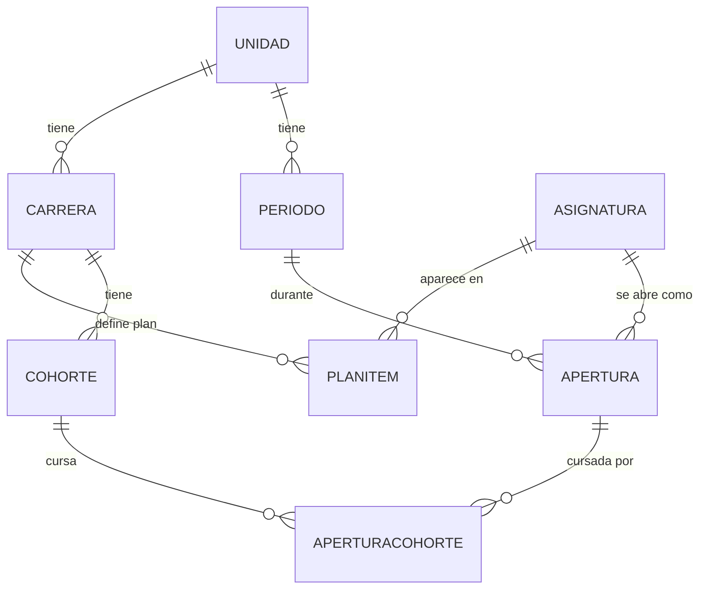

# Cómo están organizados los datos

Este documento explica, en criollo, qué guarda el sistema y cómo se relaciona una cosa con la otra. No hace falta saber programar para leerlo: la idea es que cualquiera del equipo SIED o de una dirección de carrera pueda entender por qué el sistema se comporta como se comporta, y que sirva de base común para pedir cambios o corregir lo que no cierre.

Es un documento vivo — se va a seguir ajustando a medida que el sistema crezca o que algo quede mejor explicado de otra forma.

## La idea en una sola frase

> Una **carrera** tiene un **plan de estudios** y **cohortes** de alumnos; cuando una cohorte tiene que cursar una materia del plan, se **abre** esa materia en un **período**, y esa apertura queda enganchada a la cohorte.

Todo lo demás en este documento es desarrollar esa frase, pieza por pieza.

## Las ocho piezas del negocio

### 1. Unidad

El nivel más alto de todos. Sólo existen dos: **Posgrado** y **Educación**. Todo lo demás — carreras, períodos — pertenece a una de las dos.

### 2. Carrera

Un programa concreto: "Cooperación Internacional", "Educación Inicial", "NT - Ciberseguridad". Pertenece a una Unidad.

### 3. Asignatura

Una materia puntual, identificada por su **código** (por ejemplo `EP01864`, que es "Seminario I"). Acá está el punto menos intuitivo de todo el modelo, así que vale la pena remarcarlo:

**Una asignatura existe una sola vez en todo el sistema**, aunque la cursen varias carreras a la vez.

Eso es lo que en el sistema se llama **transversal**: si "Cooperación Internacional" y "Dirección de Empresas" comparten una materia, en los datos hay **una sola fila** de Asignatura — no una copia por carrera. Esto importa porque evita que la misma materia se abra dos veces por separado cuando en realidad se dicta una sola vez para las dos.

### 4. Plan de estudios (PlanItem)

La conexión entre una Carrera y una Asignatura: dice "esta materia está en el plan de estudios de esta carrera, y va en el orden número tal". Es lo que arma el desplegable del planificador con el plan completo, numerado.

Una asignatura transversal tiene **varias** de estas conexiones (una por cada carrera que la dicta), pero sigue siendo una sola Asignatura por debajo.

### 5. Cohorte

Una camada de alumnos de una carrera — por ejemplo "Cohorte 2025" de Cooperación Internacional. Cada cohorte avanza por el plan de estudios a su propio ritmo: una cohorte puede ir por la materia 18 mientras otra recién arranca la 7.

### 6. Período

Un tramo de calendario con sus propias fechas: inicio de cursado, apertura y cierre de inscripción, AFI, actas, etc. Por ejemplo, `Mensual_Septiembre_2026` abre inscripción el 30/08/2026 y arranca el cursado el 09/09/2026.

Un período pertenece a una Unidad (Posgrado o Educación), **no** a una carrera puntual — todas las carreras de esa unidad comparten el mismo calendario de períodos.

### 7. Apertura

Acá se junta todo. Una Apertura es el hecho concreto de que **una Asignatura se dicta en un Período**. Es la fila que de verdad le importa a producción: tiene su propio estado (`construcción`, `maquetación`, `finalizada`, etc.) y su propio semáforo.

Al crearse, la Apertura copia las fechas del Período al que pertenece, pero quedan guardadas por separado — por si algún día hace falta una excepción puntual (hoy esa excepción todavía no se puede editar desde la pantalla; es un pendiente).

Una Apertura es única por la combinación (asignatura, período): si dos carreras abren la misma transversal en el mismo período, es **una sola** Apertura — no dos que haya que mantener sincronizadas a mano.

### 8. Apertura × Cohorte

La conexión final: qué cohorte de qué carrera está cursando una Apertura puntual. Esto es lo que permite que una Apertura transversal tenga cohortes de varias carreras enganchadas a la vez, y que si una carrera se baja de esa apertura, la otra no se vea afectada.

## Las piezas de "quién puede hacer qué"

Estas tres no son del negocio en sí (no representan carreras ni materias), sino del funcionamiento del sistema:

- **Usuario** — quién entra al sistema, con qué rol (Administración, Equipo SIED, Dirección de carrera, Consulta).
- **Usuario × Carrera** — a qué carreras puntuales tiene acceso un director (un director puede tener más de una, como el caso de Nuevas Tecnologías con sus tres orientaciones).
- **Cambio** — el historial: quién movió qué apertura, la agregó o la quitó, y cuándo. Es lo que se ve como "registro de movimientos" al pie del planificador.

## Un caso real, de punta a punta

Con datos reales del sistema, así se lee la cadena completa:

1. **Unidad**: Posgrado.
2. **Carrera**: Cooperación Internacional, dentro de esa unidad.
3. **Asignatura**: `EP01864`, "Seminario I", que figura en el plan de estudios de esa carrera (y quizás de alguna otra, si es transversal).
4. **Cohorte**: la camada de alumnos de esa carrera que le toca cursar Seminario I ahora.
5. **Período**: `Mensual_Septiembre_2026`, que abre inscripción el 30/08/2026.
6. **Apertura**: se crea la apertura de `EP01864` en `Mensual_Septiembre_2026`. Estado actual: "Construcción de contenido". El semáforo la marca **en rojo** ("no llega") porque falta poco para que abra la inscripción y la producción todavía está en una etapa temprana.
7. **Apertura × Cohorte**: esa apertura queda enganchada a la cohorte del paso 4 (y a cualquier otra cohorte, de cualquier carrera, que también la curse en ese mismo período).

Ese es el recorrido que hace el sistema cada vez que alguien planifica una apertura desde `/planificar`.

## Tabla resumen

| Pieza | En una frase | Ejemplo real |
|---|---|---|
| Unidad | El paraguas más grande: Posgrado o Educación | Posgrado |
| Carrera | Un programa concreto | Cooperación Internacional |
| Asignatura | Una materia, única en todo el sistema por su código | `EP01864` — Seminario I |
| Plan de estudios | Qué materias tiene una carrera y en qué orden | Seminario I es la #7 del plan de Cooperación Internacional |
| Cohorte | Una camada de alumnos de una carrera | Cohorte 2025 |
| Período | Un tramo de calendario con sus fechas | Mensual_Septiembre_2026 |
| Apertura | Que una materia se dicte en un período puntual, con su estado de producción | Seminario I abierta en Mensual_Septiembre_2026, en construcción |
| Apertura × Cohorte | Qué cohorte cursa esa apertura puntual | Cohorte 2025 cursa esa apertura de Seminario I |

## Por qué está separado así (y no más simple)

La pregunta natural es: ¿por qué no guardar todo junto, tipo una fila por "materia + carrera + cohorte + período"? Porque eso rompería justo en el caso más delicado del sistema: las **transversales**. Si "Seminario I" la dictan tres carreras a la vez:

- Con una fila por combinación, habría que crear y mantener sincronizadas tres copias de la misma apertura — mismo estado, mismas fechas, pero triplicado. Un cambio de estado en una y te olvidás de las otras dos, y el pipeline de producción ya no refleja la realidad.
- Con el modelo actual, hay **una** Asignatura, **una** Apertura, y tres conexiones (una por cohorte/carrera) apuntando a esa misma apertura. Cambiar el estado una vez alcanza para las tres.

Es más piezas para entender de entrada, pero evita que el sistema se desincronice solo en el caso que más duele.

## Apéndice técnico: diagrama de relaciones

Para quien quiera verlo de forma más formal (esto ya es la versión "para programador" de todo lo de arriba):

Cada línea con `o{` significa "puede haber muchos" — por ejemplo, una Asignatura puede tener muchas Aperturas (una por cada período en que se dicta), y una Apertura puede tener muchas cohortes cursándola (el caso transversal).

---

**¿Qué falta o qué no cierra?** Este documento va a seguir cambiando. Si algo de lo de arriba no coincide con cómo lo pensás vos, o hace falta explicar mejor una parte para poder pedir un cambio concreto, decilo y se corrige acá mismo.
